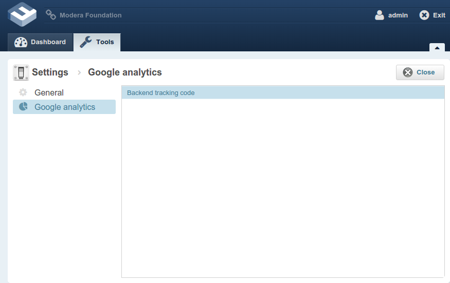

# ModeraBackendConfigUtilsBundle

Bundle provides tools that simplify contributing your own configuration sections to "Backend/Tools/Settings" section.

## Installation

Add this dependency to your composer.json:

    "modera/backend-config-utils-bundle": "~1.0"

Update your AppKernel class and add this:

    new Modera\BackendConfigUtilsBundle\ModeraBackendConfigUtilsBundle(),

## Documentation

For a example how to contribute a settings page using tools provided by this bundle please take a look at
[SettingsSectionsProvider](https://github.com/modera/ModeraBackendGoogleAnalyticsConfigBundle/blob/master/Contributions/SettingsSectionsProvider.php)
from ModeraBackendGoogleAnalyticsConfigBundle, this is how it is going to look in UI:

For more details regarding available configuration properties for in-place editor fields available for configuration
grid take a look at [PropertiesGrid.js](Resources/public/js/view/PropertiesGrid.js).

## Licensing

This bundle is under the MIT license. See the complete license in the bundle:
Resources/meta/LICENSE
